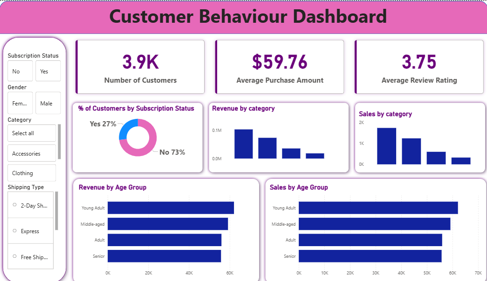

# Customer_Behaviour_Dashboard
# Customer Behaviour Dashboard | Python, SQL & Power BI

# Project Overview
This end-to-end data analytics project analyzes customer behaviour and purchasing
patterns using Python for data preprocessing, SQL for data analysis, and
Power BI for interactive visualization. The dashboard provides insights into
customer segmentation, subscription impact, category performance, and age-wise
sales trends to support data-driven decision-making.

#  Tools & Technologies
- Python (Pandas, NumPy) – Data cleaning and preprocessing
- SQL – Data analysis and KPI calculations
- Power BI Desktop – Data visualization and dashboarding
- Excel – Raw dataset

# Project Workflow
1. Cleaned and prepared raw customer data using Python (handled nulls, formatting)
2. Loaded processed data into SQL database
3. Used SQL queries to calculate KPIs and aggregations
4. Connected SQL outputs to Power BI
5. Built an interactive dashboard with slicers and KPIs

# Key KPIs
- Number of Customers
- Average Purchase Amount
- Average Review Rating
- Revenue by Category
- Sales by Category
- Subscription Status Distribution

# Dashboard Analysis
- Customer distribution by **Subscription Status (Yes / No)**
- Revenue and sales comparison across product categories
- Revenue and sales analysis by **Age Group**
- Customer behaviour insights based on gender and shipping type

# Filters & Interactivity
- Subscription Status filter
- Gender filter
- Product Category slicer
- Shipping Type filter

# Dashboard Preview

# Repository Structure
- python/ – Data cleaning and preprocessing scripts
- sql/ – SQL queries used for customer and sales analysis
- powerbi/ – Power BI dashboard (.pbix file)
- data/ – Raw dataset (Excel)
- P2_Dashboard.png – Dashboard screenshot

# Key Insights
- Majority of customers are non-subscribers, impacting total revenue
- Young Adult and Middle-aged groups contribute the highest sales
- Certain categories generate high revenue despite lower customer count
- Average review rating highlights overall customer satisfaction trends

# Author
Yogesh Baranwal
